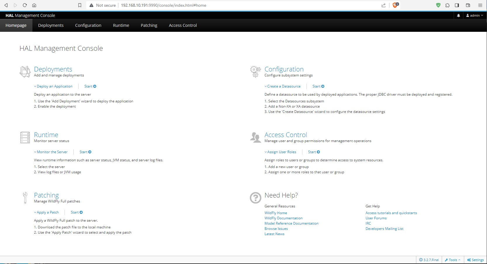
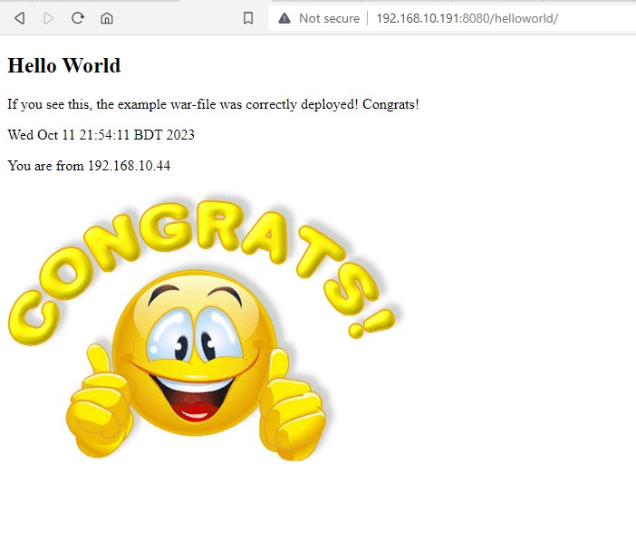

# Deploying java web application to JBoss application server: 
JBoss is a popular open-source application server and middleware platform that is now known as WildFly. It is widely used for building and deploying Java-based enterprise applications and services, and it offers a range of features for high performance, scalability, and administration. Here are the steps to install WildFly (formerly JBoss) on CentOS-7:

### Prerequisites:
- Linux System (like Centos, Redhat)
- JAVA Installed (java version 8 or higher)
- Maven
- Git 


### Download and Install JBoss/WildFly:
Visit the WildFly download page (https://www.wildfly.org/downloads/) and get the URL for the latest version of WildFly. Use '__wget__' to download it to your CentOS server. Replace the URL in the command below with the latest version:

```
cd /opt/
wget https://download.jboss.org/wildfly/19.0.0.Final/wildfly-19.0.0.Final.zip

unzip wildfly-19.0.0.Final.zip
mv wildfly-19.0.0.Final wildfly
```


### Configure WildFly Server: 
Ensure that your WildFly server is configured to bind to the appropriate IP address or hostname. By default, WildFly might be configured to listen on localhost (127.0.0.1), which means it's not accessible externally. You can change this in the WildFly configuration. 
- Edit the "standalone.xml" configuration file located in the "standalone/configuration" directory:
- Locate the <interfaces> section and ensure that the any-address element is set to your server's external IP address or 0.0.0.0 to bind to all available interfaces:

```
vim /opt/wildfly/standalone/configuration/standalone.xml

.....
.....
    <interfaces>
        <interface name="management">
            <inet-address value="${jboss.bind.address.management:0.0.0.0}"/>
        </interface>
        <interface name="public">
            <inet-address value="${jboss.bind.address:0.0.0.0}"/>
        </interface>
    </interfaces>
    .....
    .....

Save and quit
    
```


### Create a WildFly User:
You can create a new management user for WildFly using the add-user.sh script. Follow the prompts to create a new user with management rights.

```
cd /opt/wildfly/bin/
./add-user.sh

```

<details>
  <summary>Create a WildFly New user:</summary>

What type of user do you wish to add? \
 a) Management User (mgmt-users.properties) \
 b) Application User (application-users.properties)\
(a): **a**

Enter the details of the new user to add. \
Using realm 'ManagementRealm' as discovered from the existing property files. \
Username : **admin**

User 'admin' already exists and is _disabled_, would you like to... \
 a) Update the existing user password and roles \
 b) Enable the existing user \
 c) Type a new username \
(a): **a**

Password recommendations are listed below. To modify these restrictions edit the add-user.properties configuration file.
 - The password should be different from the username 
 - The password should not be one of the following restricted values {root, admin, administrator} 
 - The password should contain at least 8 characters, 1 alphabetic character(s), 1 digit(s), 1 non-alphanumeric symbol(s) 

Password : **your password**

WFLYDM0098: The password should be different from the username \
Are you sure you want to use the password entered yes/no? **yes** \
Re-enter Password : **your password**

What groups do you want this user to belong to? (Please enter a comma separated list, or leave blank for none)[  ]: **Hit Enter**

Updated user 'admin' to file '/jboss/wildfly/standalone/configuration/mgmt-users.properties' \
Updated user 'admin' to file '/jboss/wildfly/domain/configuration/mgmt-users.properties' \
Updated user 'admin' with groups  to file '/jboss/wildfly/standalone/configuration/mgmt-groups.properties' \
Updated user 'admin' with groups  to file '/jboss/wildfly/domain/configuration/mgmt-groups.properties' \

Is this new user going to be used for one AS process to connect to another AS process? 

e.g. for a slave host controller connecting to the master or for a Remoting connection for server to server EJB calls.
yes/no? **yes**

To represent the user add the following to the server-identities definition <secret value="YWRtaW4=" />

</details>


### Start WildFly:
Start WildFly by running the "standalone.sh" script. You might need to use "sudo" if your user doesn't have the necessary permissions. Start WildFly application server using the following command:

```
### Check JAVA Version:
java -version
```

```
### Check Server IP:

# ifconfig
ens160: flags=4163<UP,BROADCAST,RUNNING,MULTICAST>  mtu 1500
        inet 192.168.10.191  netmask 255.255.255.0  broadcast 192.168.10.255
        inet6 fe80::358c:f05a:db68:fb0b  prefixlen 64  scopeid 0x20<link>
        ether 00:0c:29:80:7c:86  txqueuelen 1000  (Ethernet)
        RX packets 1578458  bytes 850547841 (811.1 MiB)
        RX errors 0  dropped 0  overruns 0  frame 0
        TX packets 425441  bytes 82335576 (78.5 MiB)
        TX errors 0  dropped 0 overruns 0  carrier 0  collisions 0
```


```
### Start the WildFly Service:

cd /opt/wildfly/bin/
./standalone.sh

```


In a default installation of JBoss/WildFly, the primary HTTP listener port used for web applications is port 8080 and administration console (management interface) typically listens on port 9990.

```
netstat -tulpn | grep 8080
tcp        0      0 0.0.0.0:8080            0.0.0.0:*               LISTEN      19556/java

netstat -tulpn | grep 9990
tcp        0      0 0.0.0.0:9990            0.0.0.0:*               LISTEN      19556/java
```

### Wildfly Admin Web Console:
WildFly should now be running, and you can access the admin console at http://your-ip:9990




### Build the WAR File: (Optional)
Here, build the sample hello world java application packaged as a WAR file.

<details>
  <summary>Build the WAR File:</summary>

1. git clone https://github.com/technbd/deploying-jboss-app-server.git
2. cd deploying-jboss-app-server
3. mvn clean package
4. then deploy WAR file: target/hello-1.0.war

```
ls -l target/hello-1.0.war
-rw-r--r-- 1 root root 30346 Oct 12 19:42 target/hello-1.0.war
```

Done!
Open your browser at http://your-ip:port/app-name or like http://your-ip:8080/hello:1.0

</details>

### Deploy the WAR File:
To deploy an application using JBoss (or its successor, WildFly), you can follow these general steps.  I'll provide an overview of the process, but please note that specific details may vary depending on your JBoss/WildFly version and the type of application you are deploying (e.g., WAR, EAR, or JAR file).

```
### WAR file location: 
cd /jboss/war_file/

ls -l
-rw-r--r-- 1 root root 74333 Oct 11 20:51 helloworld.war

```

### Mehtod-1:
```
cd /opt/wildfly/bin/


### Open CLI and Connect the server:

./jboss-cli.sh
connect 192.168.10.191:9990


### Deploy WAR file:
deploy /path/to/file.war
deploy /jboss/war_file/helloworld.war


### Check the WAR file deploy or not: 
deployment list


### Undeploy WAR file and again Deploy for updated WAR file: 
undeploy helloworld.war

quit

```

```
# ls -l /opt/wildfly/standalone/tmp/

drwx------ 2 root root 4096 Oct 11 20:58 auth
drwxr-xr-x 3 root root 4096 Oct 11 21:00 helloworld.war
-rw-r--r-- 1 root root   21 Oct 11 20:39 startup-marker
drwxr-xr-x 3 root root 4096 Oct 11 20:39 vfs
```

### Mehtod-2:
WAR file directly copy and paste source to destination directory:

```
cp /jboss/war_file/helloworld.war /opt/wildfly/standalone/deployments/
```

```
### Check log:

tail -f /opt/wildfly/standalone/log/server.log
```

### Test the Accessibility:
To verify if your WildFly server is accessible from the internet, you can try accessing it using a web browser or tools like "curl" from a remote machine. For example, http://your-ip:8080/your-app




Remember that the exact steps and configurations might vary depending on the version of JBoss or WildFly you're using. Always consult the official documentation or resources specific to your version for the most accurate and up-to-date information.

Ensure that you have appropriate security measures in place to protect your server from unauthorized access and attacks when exposing it to the internet. This may include setting up firewalls, access controls, and using secure protocols like HTTPS for sensitive data transmission.

